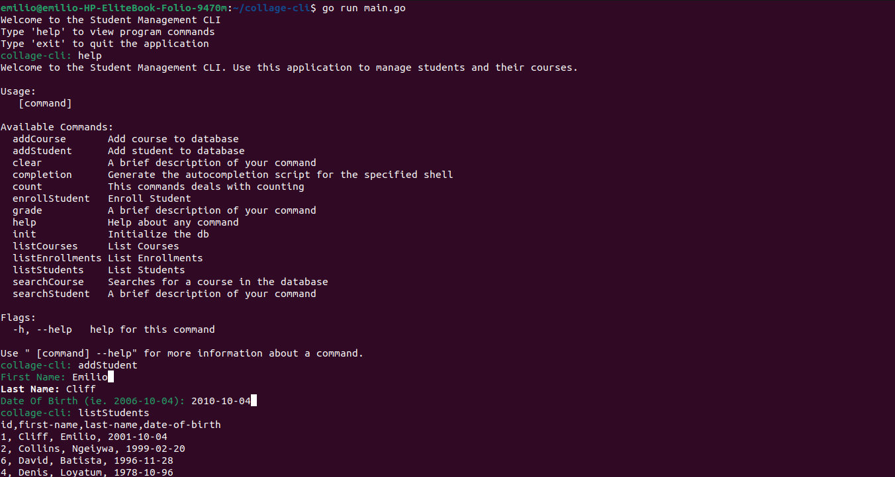

# 📚 Collage CLI - Student Management System

Welcome to the **Collage CLI**! 🎓 This command-line interface (CLI) tool is designed for managing student, courses and semesters in a collage/institution records efficiently. Built with the power of Go, the Cobra library and the PromptUI, it provides a user-friendly way to handle various student management tasks directly from your terminal. 🚀

## 🚀 Features

It basically use sqlite for its database and CRUD operation on the tables with some advanced operations ie searches and even aggregated data

- **Add New Student**: Quickly add student record with essential details.
- **Add New Course**: Quickly add course records with essential details.
- **Count**: Count can count each course and students number chech the help command for more description
- **Enroll Student**: Enrolls a student to a particular course and semester.

## 📦 Installation

1. **Clone the Repository:**

   ```bash
   git clone https://github.com/EmilioCliff/collage-cli.git

   ```

1. **Navigate to the Project Directory:**

   ```bash
   cd collage-cli

   ```

1. **Build the Application:**

   ```bash
   go build -o collage-cli

   ```

1. **Run the Application:**
   ```bash
   ./collage-cli
   ```

## 📚 Documentation

For more detailed documentation on each command and option, run in the terminal session:

```bash
   help
```



## 💬 Remarks

Project not complete. Feel free to tweak around.
